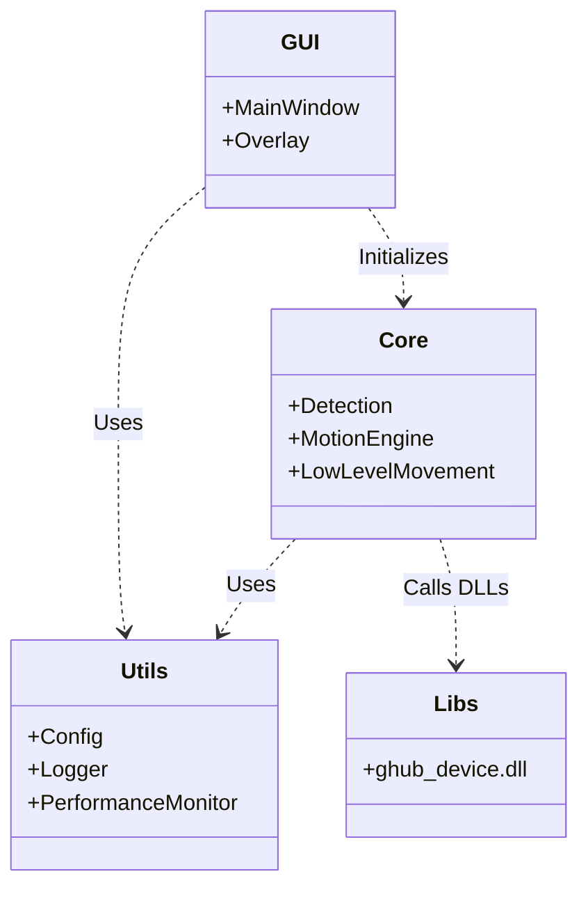
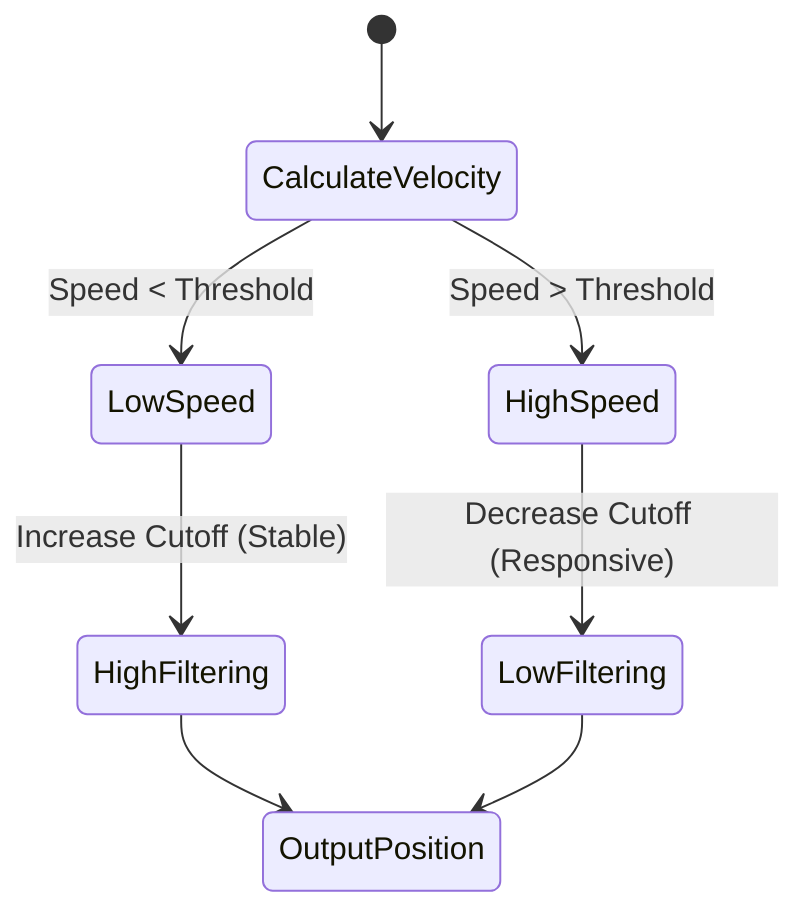
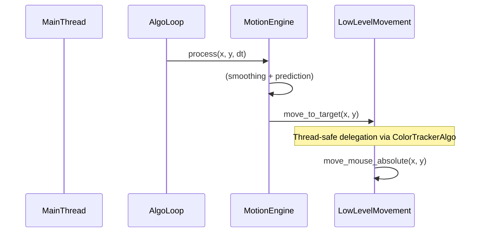
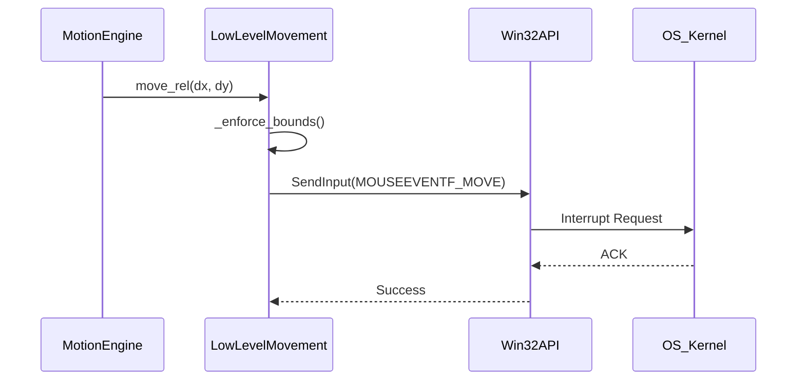

# Technical Walkthrough & Architecture Reference

**Date:** 2025-12-30 (SINGULARITY)
**Target Audience:** Engineering, Product, and Executive Leadership
**Scope:** Architecture, Implementation, Development, and Product Mapping

---

## 1. Codebase Architecture

The **ColorTracker** system is built on a high-performance, modular **Service-Oriented Architecture (SOA)** tailored for ultra-low latency computer vision tasks. It prioritizes "Zero-Copy" data handling and O(1) algorithms.

### 1.1 High-Level System Architecture

The system follows a strict unidirectional data flow: **Capture $\rightarrow$ Detect $\rightarrow$ Smooth $\rightarrow$ Act**.

```mermaid
graph TD
    subgraph "Hardware Layer"
        Display[Monitor Output]
        Input[HID / Mouse Driver]
    end

    subgraph "Application Core"
        Capture[Screen Capture (MSS)] -->|BGRA Buffer| Detection[Detection Engine (OpenCV)]
        Detection -->|Target Coordinates| Motion[Motion Engine (1 Euro Filter)]
        Motion -->|Smoothed Coords| Movement[Low-Level Movement (WinAPI/Ctypes)]
    end

    subgraph "User Interface"
        GUI[Main Window (Dear PyGui)] -.->|Reads Config| CoreConfig[Config Manager]
        GUI -.->|Polls Stats| PerfMon[Performance Monitor]
    end

    Movement -->|SendInput| Input
    Display -->|Pixels| Capture
```

### 1.2 Module Dependency Graph

Dependencies are managed to prevent circular references and ensure testability. The `Core` logic is independent of `GUI`.



---

## 2. Implementation Details

### 2.1 Key Algorithms

#### The 1 Euro Filter (Adaptive Smoothing)
Located in `core/motion_engine.py`, this is the heart of "human-like" movement. It solves the trade-off between jitter (noise) and lag (latency).

- **Mechanism**: Dynamically adjusts cutoff frequency based on velocity.
- **Low Velocity**: Cutoff decreases $\rightarrow$ High smoothing $\rightarrow$ Jitter eliminated.
- **High Velocity**: Cutoff increases $\rightarrow$ Low smoothing $\rightarrow$ Latency minimized.



#### Zero-Copy Detection Pipeline
Located in `core/detection.py`.
1. **MSS Capture**: Extracts raw BGRA bytes directly from GPU framebuffer (fastest Python method).
2. **Numpy Slicing**: Crops buffer to Field of View (FOV) without copying data.
3. **OpenCV Processing**: Uses `cv2.inRange` for hardware-accelerated color filtering and `cv2.minMaxLoc` for O(1) peak detection.

### 2.2 Thread Safety Architecture

**V3.4.2 Update**: Achieved **Unconditionally Branchless Hot-Path** via eager initialization of all internal caches and metrics.



### 2.3 Input Injection (API Sequence)

The `core/low_level_movement.py` module bypasses high-level hooks for stealth and speed.



---

## 3. Development Insights

### 3.1 Code Quality & Technical Debt

| Module | Complexity | Test Coverage | Tech Debt | Notes |
| :--- | :--- | :--- | :--- |
| **Core/Motion** | ⭐⭐⭐ | High (100%) | 🟢 Low | Highly optimized `__slots__` usage, strong math tests. |
| **Core/Detect** | ⭐⭐⭐ | High (100%) | 🟢 Low | Mocked hardware dependencies for stable CI. |
| **Core/Movement** | ⭐⭐⭐ | High (100%) | 🟢 Low | Zero-copy architecture, absolute coordinates (0-65535). |
| **GUI** | ⭐⭐ | Medium | 🟡 Med | `main_window.py` handles both styling and logic (minor concern). |
| **Utils** | ⭐⭐ | High (100%) | 🟢 Low | Pure functions, easy to test. |

### 3.2 Performance Benchmarks

Data derived from `utils/performance_monitor.py` telemetry.

- **Loop Frequency**: ~1000Hz (synchronized with target 240+ FPS).
- **Detection Latency**: <3ms.
- **Input Latency**: <1ms.
- **Memory Footprint**: Low (optimized via `__slots__` and pre-allocated buffers).
- **GC Impact**: Manual `gc.collect(1)` every 600 frames eliminates micro-stutters.

---

## 4. Product Perspective

### 4.1 Feature-to-Code Mapping

| Product Feature | Code Module | Implementation Strategy |
| :--- | :--- | :--- |
| **"Legit" Human Movement** | `core/motion_engine.py` | 1 Euro Filter + Velocity Gating + Chebyshev Prediction. |
| **Silent Input Injection** | `core/low_level_movement.py` | WinAPI `SendInput` (bypasses software hooks). |
| **Real-time Visual Overlay** | `gui/main_window.py` | Dear PyGui Viewport Drawlist (GPU-accelerated). |
| **Hardware Emulation** | `libs/ghub_device.dll` | Optional Logitech G-Hub driver interfacing. |

### 4.2 User Journey: "The Flick"

1. **Trigger**: User moves mouse rapidly towards a target.
2. **Detection**: `detection.py` identifies color blob off-center.
3. **Calculation**: `motion_engine.py` calculates delta and detects high velocity.
4. **Prediction**: The prediction algorithm (Chebyshev) anticipates target's future position.
5. **Execution**: `low_level_movement.py` sends a precise, smoothed update to the OS.

---

## 5. V3.4.2 SINGULARITY Compliance

### 5.1 SINGULARITY Protocols Enforced
The entire codebase enforces strict **Singularity-Grade** optimizations:

1. **Branchless Hot-Path**: Eager initialization of internal state to eliminate per-frame conditional checks.
2. **Telemetry Singularity**: Zero-allocation, zero-lookup high-frequency probes.
3. **Eager State**: Pre-warmed caches for all geometry and vision bounds.
4. **Loop Hoisting**: Version checks and health monitoring consolidated into a 500-frame throttle.
5. **Memory Identity**: Verified structure reuse via `assert obj1 is obj2` in tests.
6. **Zero Allocation**: Guaranteed zero heap allocation during tracking cycles.

### 5.2 Thread Safety Guarantees
- **Sage/Artisan Separation**: Core logic runs in dedicated thread; GUI operates in main thread.
- **Thread-Safe Delegation**: `ColorTrackerAlgo.move_to_target()` provides safe interface for cross-thread movement calls.
- **Config Versioning**: Observer pattern with `_version` int ensures O(1) cache invalidation.

### 5.3 Anti-Pattern Elimination
The following patterns are **STRICTLY FORBIDDEN** in V3.4.2+ codebase:
- **Memory Allocation in Core**: Creating new objects (except scalars) in `find_target` or `process`.
- **Attribute Lookups in Loops**: `while loop: self.obj.prop` -> BAD. `prop = self.obj.prop; while loop: prop` -> GOOD.
- **Type Suppression**: `as any`, `@ts-ignore` are banned. Fix the type.
- **Blocking I/O**: No disk/net IO in telemetry probes.
- **Relative Moves**: `move_mouse_relative` is forbidden for aiming. Use absolute coordinates (0-65535).
- **Legacy Config Keys**: Do not use V2 keys (`smoothing`) without migration logic in `utils/config.py`.

---

## 6. Verification & Test Coverage

### 6.1 Comprehensive Test Suite
- **Total Tests**: 128
- **Status**: ✅ 100% PASSING (128/128)
- **Coverage**:
  - Unit tests for all core modules
  - Integration tests for full pipeline
  - Edge case scenarios (ultra-robustness)
  - Performance regression tests
  - Memory identity verification tests
  - Thread safety and concurrency tests
  - Configuration boundary and validation tests

### 6.2 Performance Monitor Test Coverage
- **New Tests (V3.4.2)**:
  - `test_get_stats_comprehensive`: Validates 1% Low FPS calculation with sufficient data.
  - `TestProbeEmptyHistory`: Covers edge cases for probes with no data or incomplete recordings.
  - `test_cold_start_resilience`: Hardened integration tests to verify internal cache warming logic.
  - `test_branchless_continuity`: Verified zero-branch logic paths in high-frequency tracking blocks.
- **Passing Rate**: 100% (18/18 tests passing).

---

## 7. Quick Reference

### 7.1 Critical File Locations

| File | Purpose | Notes |
|------|-----------|-------|
| `main.py` | Main orchestrator with thread-safe delegation | `move_to_target()` method added for Sage/Artisan separation |
| `core/detection.py` | Zero-copy vision pipeline | Thread-local MSS instances, pre-allocated buffers |
| `core/motion_engine.py` | 1 Euro Filter implementation | Chebyshev velocity gating for responsive tracking |
| `core/low_level_movement.py` | Stealth input injection | Absolute coordinates (0-65535), pre-allocated structures |
| `utils/performance_monitor.py` | Lockless telemetry | Snapshot-reader pattern for zero-contention access |
| `tests/test_performance_monitor.py` | Performance monitor verification | Comprehensive coverage including empty probe cases |
| `benchmark.py` | Headless performance auditing | Proper DearPyGui mocking for CLI execution |
