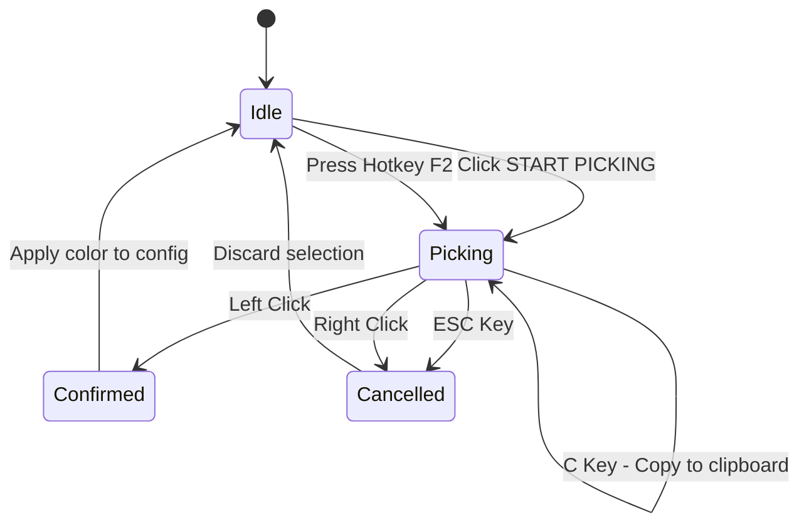
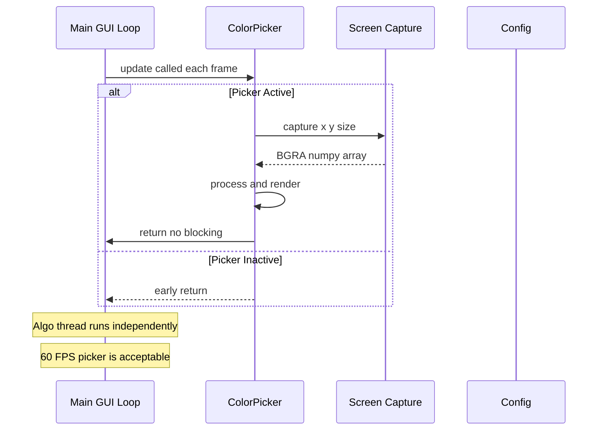
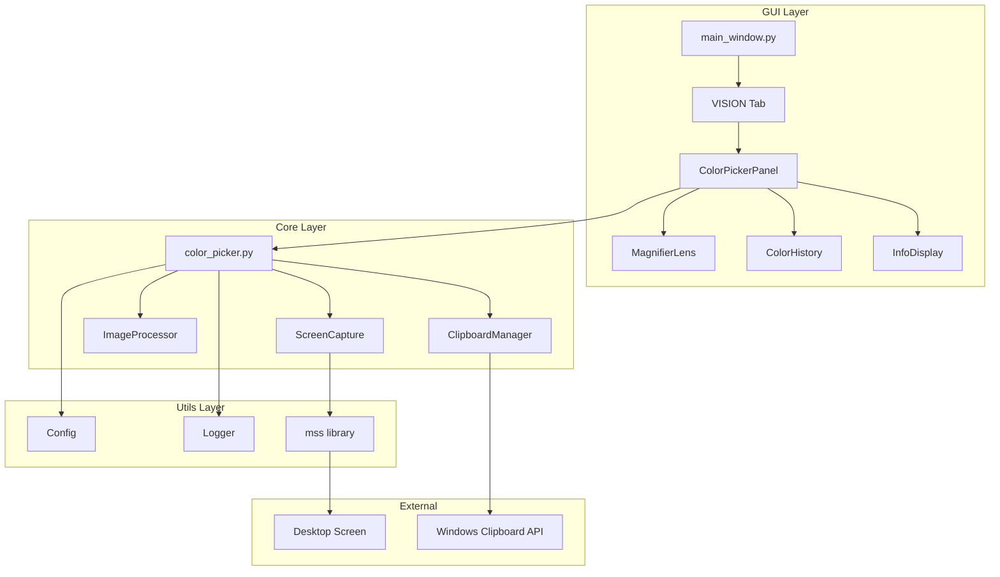

# Color Picker V4 - Eyedropper Design Document

**Version**: 4.0.0  
**Status**: ULTRATHINK-SINGULARITY Design  
**Archetype**: The Artisan (Visual/Physics) + The Sage (Logic/Data)  
**Date**: 2026-01-03

---

## 1. ASCII MOCKUPS

### 1.1 Main Color Picker Panel (Embedded in VISION Tab)

```
┌─────────────────────────────────────────────────────────────────────┐
│                          VISION TAB                                  │
├─────────────────────────────────────────────────────────────────────┤
│                                                                      │
│  COLOR SPECTRUM                                                      │
│  ──────────────────────────────────────────────────────────────────  │
│                                                                      │
│  ┌─────────────────────────────────────────────────────────────────┐ │
│  │                    EYEDROPPER PANEL                             │ │
│  │  ┌───────────────────────────────────────────────────────────┐  │ │
│  │  │                                                           │  │ │
│  │  │  ╭─────────────────╮    ┌─────────────────────────────┐   │  │ │
│  │  │  │                 │    │  HEX:  #C9008D              │   │  │ │
│  │  │  │   MAGNIFIED     │    │  RGB:  201, 0, 141          │   │  │ │
│  │  │  │   LENS VIEW     │    │  HSL:  325°, 100%, 39%      │   │  │ │
│  │  │  │   ┼───────┼     │    │  XY:   960, 540             │   │  │ │
│  │  │  │                 │    ├─────────────────────────────┤   │  │ │
│  │  │  │                 │    │  [■] Current  [■] Previous  │   │  │ │
│  │  │  ╰─────────────────╯    └─────────────────────────────┘   │  │ │
│  │  │                                                           │  │ │
│  │  │  [ 🎯 START PICKING ]  [ 📋 COPY HEX ]  [ 📋 COPY RGB ]   │  │ │
│  │  │                                                           │  │ │
│  │  └───────────────────────────────────────────────────────────┘  │ │
│  │                                                                 │ │
│  │  RECENT COLORS                                                  │ │
│  │  ┌───┬───┬───┬───┬───┬───┬───┬───┬───┬───┐                      │ │
│  │  │ ■ │ ■ │ ■ │ ■ │ ■ │ ■ │ ■ │ ■ │ ■ │ ■ │  (Click to reuse)    │ │
│  │  └───┴───┴───┴───┴───┴───┴───┴───┴───┴───┘                      │ │
│  │                                                                 │ │
│  └─────────────────────────────────────────────────────────────────┘ │
│                                                                      │
│  ┌─────────────────────────────────────────────────────────────────┐ │
│  │ R ████████████████░░░░░░░░░░░░░░░░░░░░░░░░░░░░░░░░░  201        │ │
│  │ G ░░░░░░░░░░░░░░░░░░░░░░░░░░░░░░░░░░░░░░░░░░░░░░░░░  0          │ │
│  │ B █████████████████████████░░░░░░░░░░░░░░░░░░░░░░░░  141        │ │
│  └─────────────────────────────────────────────────────────────────┘ │
│                                                                      │
│  Tolerance (Match Width)                                             │
│  ████████░░░░░░░░░░░░░░░░░░░░░░░░░░░░░░░░░░░░░░░░░░░░░  10          │
│                                                                      │
└─────────────────────────────────────────────────────────────────────┘
```

### 1.2 Floating Magnifier Lens (During Active Picking)

```
                    ┌──────────────────────────────────┐
                    │        FLOATING LENS             │
                    │   (Follows mouse cursor)         │
                    └──────────────────────────────────┘

                         ╭───────────────────────╮
                        ╱                         ╲
                       │  ▓▓▓▓▓▓▓▓▓▓▓▓▓▓▓▓▓▓▓▓▓  │
                       │  ▓▓▓▓▓▓▓▓▓▓▓▓▓▓▓▓▓▓▓▓▓  │
                       │  ▓▓▓▓▓▓▓▓▓▓▓▓▓▓▓▓▓▓▓▓▓  │
                       │  ▓▓▓▓▓▓▓▓▓▓▓▓▓▓▓▓▓▓▓▓▓  │
                       │  ▓▓▓▓▓▓▓▓▓┼───────┼▓▓▓  │  ← Crosshair
                       │  ▓▓▓▓▓▓▓▓▓│   ◉   │▓▓▓  │  ← Center pixel
                       │  ▓▓▓▓▓▓▓▓▓┼───────┼▓▓▓  │
                       │  ▓▓▓▓▓▓▓▓▓▓▓▓▓▓▓▓▓▓▓▓▓  │
                       │  ▓▓▓▓▓▓▓▓▓▓▓▓▓▓▓▓▓▓▓▓▓  │
                        ╲                         ╱
                         ╰───────────────────────╯
                              ╱           ╲
                    ┌────────────────────────────────┐
                    │   DATA PILL (Floating Below)   │
                    ├────────────────────────────────┤
                    │   #C9008D   RGB(201,0,141)     │
                    │   XY: 960, 540   ZOOM: 8x      │
                    └────────────────────────────────┘
```

### 1.3 Lens Detail View (At Maximum Zoom)

```
    ╭─────────────────────────────────────────────────────╮
    │  ┌────┬────┬────┬────┬────┬────┬────┬────┬────┐    │
    │  │████│████│████│▓▓▓▓│▓▓▓▓│▓▓▓▓│░░░░│░░░░│░░░░│    │
    │  ├────┼────┼────┼────┼────┼────┼────┼────┼────┤    │
    │  │████│████│████│▓▓▓▓│▓▓▓▓│▓▓▓▓│░░░░│░░░░│░░░░│    │
    │  ├────┼────┼────┼────┼────┼────┼────┼────┼────┤    │
    │  │████│████│████│▓▓▓▓│▓▓▓▓│▓▓▓▓│░░░░│░░░░│░░░░│    │
    │  ├────┼────┼────┼────╔════╗────┼────┼────┼────┤    │
    │  │▓▓▓▓│▓▓▓▓│▓▓▓▓│▓▓▓▓║ ◉  ║▓▓▓▓│▓▓▓▓│▓▓▓▓│▓▓▓▓│    │ ← Center pixel
    │  ├────┼────┼────┼────╚════╝────┼────┼────┼────┤    │   highlighted
    │  │░░░░│░░░░│░░░░│▓▓▓▓│▓▓▓▓│▓▓▓▓│████│████│████│    │
    │  ├────┼────┼────┼────┼────┼────┼────┼────┼────┤    │
    │  │░░░░│░░░░│░░░░│▓▓▓▓│▓▓▓▓│▓▓▓▓│████│████│████│    │
    │  ├────┼────┼────┼────┼────┼────┼────┼────┼────┤    │
    │  │░░░░│░░░░│░░░░│▓▓▓▓│▓▓▓▓│▓▓▓▓│████│████│████│    │
    │  └────┴────┴────┴────┴────┴────┴────┴────┴────┘    │
    │                                                     │
    │     9x9 pixel grid visible at 16x zoom              │
    ╰─────────────────────────────────────────────────────╯

    LEGEND:
    ████ = Dark pixels     ▓▓▓▓ = Medium pixels
    ░░░░ = Light pixels    ◉    = Exact target pixel
    ╔══╗ = Crosshair highlight box
```

### 1.4 Keyboard Shortcuts Overlay (During Picking)

```
    ┌─────────────────────────────────────────────────────────────────┐
    │                    ACTIVE PICKING MODE                          │
    │  ─────────────────────────────────────────────────────────────  │
    │                                                                 │
    │    ┌───┐                                                        │
    │    │ ↑ │  Move 1 pixel up                                       │
    │  ┌─┴───┴─┐                                                      │
    │  │ ← │ → │  Move 1 pixel left/right                             │
    │  └─┬───┬─┘                                                      │
    │    │ ↓ │  Move 1 pixel down                                     │
    │    └───┘                                                        │
    │                                                                 │
    │    ┌───────────────┐                                            │
    │    │   SCROLL ↕    │  Zoom in/out (8x - 20x)                    │
    │    └───────────────┘                                            │
    │                                                                 │
    │    ┌───────────────┐                                            │
    │    │  LEFT CLICK   │  Confirm selection                         │
    │    └───────────────┘                                            │
    │                                                                 │
    │    ┌───────────────┐  ┌───────────────┐                         │
    │    │     ESC       │  │  RIGHT CLICK  │  Cancel picking         │
    │    └───────────────┘  └───────────────┘                         │
    │                                                                 │
    │    ┌───────────────┐                                            │
    │    │       C       │  Copy HEX to clipboard                     │
    │    └───────────────┘                                            │
    │                                                                 │
    │    ┌───────────────┐                                            │
    │    │   SHIFT+C     │  Copy RGB to clipboard                     │
    │    └───────────────┘                                            │
    │                                                                 │
    └─────────────────────────────────────────────────────────────────┘
```

### 1.5 Visual State Indicators

```
    STATE: IDLE (Not picking)
    ┌────────────────────────────────────────┐
    │  [ 🎯 START PICKING ]                  │  ← Gray/Neutral button
    │                                        │
    │  Lens Preview: [Empty/Last Color]      │
    └────────────────────────────────────────┘

    STATE: ACTIVE (Currently picking)
    ┌────────────────────────────────────────┐
    │  [ ⏹ STOP PICKING ]                   │  ← Pulsing/Active button
    │                                        │
    │  Lens Preview: [Live Feed]             │
    │  Status: "Move mouse to pick color"    │
    └────────────────────────────────────────┘

    STATE: SELECTED (Color confirmed)
    ┌────────────────────────────────────────┐
    │  [ ✓ COLOR APPLIED ]                   │  ← Green success flash
    │                                        │
    │  Lens Preview: [Selected Color]        │
    │  Status: "Color #C9008D applied"       │
    └────────────────────────────────────────┘

    STATE: CANCELLED (ESC pressed)
    ┌────────────────────────────────────────┐
    │  [ ✗ CANCELLED ]                       │  ← Brief red flash
    │                                        │
    │  Lens Preview: [Previous Color]        │
    │  Status: "Selection cancelled"         │
    └────────────────────────────────────────┘
```

### 1.6 Color History Panel

```
    RECENT COLORS (Last 10 picks)
    ┌─────────────────────────────────────────────────────────────────┐
    │  ┌─────┐ ┌─────┐ ┌─────┐ ┌─────┐ ┌─────┐ ┌─────┐ ┌─────┐       │
    │  │█████│ │█████│ │█████│ │█████│ │█████│ │░░░░░│ │░░░░░│ ...   │
    │  │█████│ │█████│ │█████│ │█████│ │█████│ │░░░░░│ │░░░░░│       │
    │  │█████│ │█████│ │█████│ │█████│ │█████│ │░░░░░│ │░░░░░│       │
    │  └──┬──┘ └──┬──┘ └──┬──┘ └──┬──┘ └──┬──┘ └──┬──┘ └──┬──┘       │
    │     │       │       │       │       │       │       │          │
    │  #C9008D #FF5733 #33FF57 #3357FF #FFFF33  Empty   Empty        │
    │  [Active] [Click to apply]                                      │
    │                                                                 │
    │  Hover tooltip: "RGB(201,0,141) - Click to use, Right-click    │
    │                  to copy"                                       │
    └─────────────────────────────────────────────────────────────────┘
```

### 1.7 Accessibility: High Contrast Mode

```
    HIGH CONTRAST MODE (For color blindness / visibility)
    ┌─────────────────────────────────────────────────────────────────┐
    │                                                                 │
    │  ╔═══════════════════════════════════════════════════════════╗  │
    │  ║  THICK WHITE BORDERS ON ALL INTERACTIVE ELEMENTS          ║  │
    │  ║                                                           ║  │
    │  ║  ┌─────────────────────────────────────────────────────┐  ║  │
    │  ║  │                                                     │  ║  │
    │  ║  │   ╔═══════════════════╗    TEXT USES:               │  ║  │
    │  ║  │   ║   MAGNIFIER       ║    • Black on White (#FFF)  │  ║  │
    │  ║  │   ║   ╋═══════════╋   ║    • White on Black (#000)  │  ║  │
    │  ║  │   ║                   ║    • No color-only info     │  ║  │
    │  ║  │   ╚═══════════════════╝                             │  ║  │
    │  ║  │                                                     │  ║  │
    │  ║  │   ┌─────────────────────────────────────────────┐   │  ║  │
    │  ║  │   │  HEX:  #C9008D  [Magenta-ish]  ← Label     │   │  ║  │
    │  ║  │   │  RGB:  R:201  G:0  B:141                    │   │  ║  │
    │  ║  │   │  HSL:  H:325° S:100% L:39%                  │   │  ║  │
    │  ║  │   └─────────────────────────────────────────────┘   │  ║  │
    │  ║  │                                                     │  ║  │
    │  ║  │   COLOR NAME APPROXIMATION: "Deep Magenta"          │  ║  │
    │  ║  │   (Helps colorblind users identify colors)          │  ║  │
    │  ║  │                                                     │  ║  │
    │  ║  └─────────────────────────────────────────────────────┘  ║  │
    │  ║                                                           ║  │
    │  ╚═══════════════════════════════════════════════════════════╝  │
    │                                                                 │
    │  [HIGH CONTRAST: ON]  ← Toggle in System tab                    │
    │                                                                 │
    └─────────────────────────────────────────────────────────────────┘
```

---

## 2. FEATURE SPECIFICATION

### 2.1 Core Functionality

| Feature | Description | Priority |
|---------|-------------|----------|
| **Hover Preview** | Live magnified view of pixels under cursor | P0 - Critical |
| **Click to Select** | Left-click confirms color selection | P0 - Critical |
| **ESC to Cancel** | Escape key aborts picking without changes | P0 - Critical |
| **Arrow Key Navigation** | 1px precision movement via arrow keys | P0 - Critical |
| **Mouse Wheel Zoom** | Adjust magnification level (8x-20x) | P1 - High |
| **RGB/HEX Display** | Real-time color values during hover | P0 - Critical |
| **Apply to Config** | Selected color updates target_color | P0 - Critical |

### 2.2 Selection Mechanism



### 2.3 Keyboard Shortcuts

| Key | Action | Context |
|-----|--------|---------|
| `F2` | Toggle picking mode | Global (when app focused) |
| `←` `↑` `→` `↓` | Move virtual cursor 1px | During picking |
| `Scroll Up` | Zoom in (more magnification) | During picking |
| `Scroll Down` | Zoom out (less magnification) | During picking |
| `Left Click` | Confirm selection | During picking |
| `Right Click` | Cancel selection | During picking |
| `ESC` | Cancel selection | During picking |
| `C` | Copy HEX to clipboard | During picking |
| `Shift+C` | Copy RGB to clipboard | During picking |
| `Tab` | Cycle focus in color panel | In VISION tab |

### 2.4 Visual Feedback States

| State | UI Indicator | Sound (Optional) |
|-------|--------------|------------------|
| **Idle** | Gray START button, empty lens | None |
| **Active/Picking** | Pulsing button, live lens feed | Soft tick on start |
| **Hovering** | Crosshair updates, values update | None |
| **Selected** | Green flash, "Applied" text | Success chime |
| **Cancelled** | Red flash, "Cancelled" text | Cancel beep |
| **Error** | Orange flash, error message | Error beep |

---

## 3. QUALITY OF LIFE (QoL) FEATURES

### 3.1 Copy to Clipboard

```python
# Clipboard Formats
CLIPBOARD_HEX = "#C9008D"          # Default format
CLIPBOARD_RGB = "rgb(201, 0, 141)" # CSS format
CLIPBOARD_RGB_TUPLE = "201, 0, 141" # Plain tuple
CLIPBOARD_HSL = "hsl(325, 100%, 39%)" # HSL format
```

**Implementation:**
- Use `pyperclip` or `ctypes` windll for clipboard access
- Visual feedback: Brief tooltip "Copied!" near button
- Keyboard: `C` copies HEX, `Shift+C` copies RGB

### 3.2 Color History (Recent Picks)

```python
class ColorHistory:
    MAX_COLORS = 10
    
    def __init__(self):
        self._colors: list[int] = []  # List of 0xRRGGBB integers
    
    def add(self, color: int) -> None:
        # Remove if already exists (move to front)
        if color in self._colors:
            self._colors.remove(color)
        # Add to front
        self._colors.insert(0, color)
        # Trim to max
        self._colors = self._colors[:self.MAX_COLORS]
    
    def get_all(self) -> list[int]:
        return self._colors.copy()
```

**UI Behavior:**
- Click history swatch → Apply color immediately
- Right-click history swatch → Copy HEX to clipboard
- Hover → Show tooltip with full color info
- Persist to config.json under `color_history` key

### 3.3 Zoom Level Control

| Level | Capture Size | Magnification | Grid Visibility | Use Case |
|-------|--------------|---------------|-----------------|----------|
| 1 | 20x20 px | 8x | Low alpha grid | Wide view |
| 2 | 16x16 px | 10x | Medium grid | Default |
| 3 | 12x12 px | 13x | Visible grid | Fine work |
| 4 | 10x10 px | 16x | Bold grid | Precision |
| 5 | 8x8 px | 20x | Maximum grid | Pixel-perfect |

**Scroll Behavior:**
- Scroll Up → Zoom In (higher magnification, fewer pixels)
- Scroll Down → Zoom Out (lower magnification, more pixels)
- Display current zoom in data pill: "ZOOM: 16x"

### 3.4 Crosshair Precision Mode

```
    STANDARD MODE                PRECISION MODE (Hold Shift)
    ┌─────────────────┐          ┌─────────────────┐
    │      │          │          │   ═══════════   │
    │      │          │          │   ║         ║   │
    │ ─────┼───── ←   │          │   ║    ◎    ║   │
    │      │          │          │   ║         ║   │
    │      │          │          │   ═══════════   │
    └─────────────────┘          └─────────────────┘
    
    Simple crosshair              Box around center pixel
                                  with corner markers
```

**Features:**
- Hold `Shift` to enable precision mode
- Precision mode adds:
  - Thicker crosshair lines (2px)
  - Box outline around exact center pixel
  - Contrast shadow for visibility on any color

### 3.5 Multi-Monitor Support

```python
def get_capture_region(x: int, y: int, size: int) -> dict:
    """
    Calculate capture region handling multi-monitor setups.
    MSS handles negative coordinates for monitors left of primary.
    """
    half = size // 2
    return {
        "left": x - half,
        "top": y - half,
        "width": size,
        "height": size
    }

def get_all_monitors() -> list[dict]:
    """Returns list of monitor geometries from mss."""
    with mss.mss() as sct:
        return sct.monitors  # [0] = combined, [1+] = individual
```

---

## 4. ACCESSIBILITY (a11y) CONSIDERATIONS

### 4.1 Screen Reader Support

DearPyGui doesn't have native ARIA support, but we can implement:

```python
# Pseudo-ARIA via tooltips and status text
class A11yAnnouncer:
    """Provides screen reader-like announcements via status text."""
    
    def __init__(self, status_text_id: int):
        self._status_id = status_text_id
    
    def announce(self, message: str) -> None:
        """Update status text for screen reader to pick up."""
        dpg.set_value(self._status_id, message)
        # Also log for debugging
        print(f"[A11y] {message}")
    
    # Pre-defined announcements
    def picking_started(self):
        self.announce("Color picking started. Use arrow keys to move, Enter to select, Escape to cancel.")
    
    def color_preview(self, hex_val: str, r: int, g: int, b: int):
        self.announce(f"Hovering over color {hex_val}. Red {r}, Green {g}, Blue {b}.")
    
    def color_selected(self, hex_val: str):
        self.announce(f"Color {hex_val} selected and applied.")
    
    def picking_cancelled(self):
        self.announce("Color picking cancelled.")
```

### 4.2 Keyboard-Only Operation Path

```
    FULL KEYBOARD WORKFLOW:
    
    1. Tab to VISION tab
    2. Tab to "START PICKING" button
    3. Press Enter/Space to activate
    4. Use Arrow Keys to navigate
    5. Press Space/Enter to confirm
       OR Press ESC to cancel
    6. Tab to color history if needed
    7. Enter on history swatch to apply
```

**Focus Management:**
- All interactive elements must be Tab-focusable
- Visual focus indicator (2px white outline)
- Focus trap during picking mode (prevent Tab from leaving)

### 4.3 Color Contrast Requirements

| Element | Foreground | Background | Contrast Ratio |
|---------|------------|------------|----------------|
| Body text | #FFFFFF | #47474D | 7.8:1 ✓ |
| Active button | #FFFFFF | #C9008D | 4.5:1 ✓ |
| Disabled text | #999999 | #47474D | 3.1:1 (AA Large) |
| Error text | #FF6B6B | #47474D | 4.6:1 ✓ |
| Success text | #4ADE80 | #47474D | 5.2:1 ✓ |

### 4.4 Color Blindness Accommodations

```python
# Color formats to display simultaneously
COLOR_FORMATS = {
    "hex": "#C9008D",
    "rgb": "RGB(201, 0, 141)",
    "hsl": "HSL(325°, 100%, 39%)",
    "name": "Deep Magenta"  # Approximate color name
}

# Approximate color name using nearest match
def get_color_name(r: int, g: int, b: int) -> str:
    """Return approximate color name for accessibility."""
    COLOR_NAMES = {
        # Basic colors with tolerance matching
        (255, 0, 0): "Red",
        (0, 255, 0): "Green",
        (0, 0, 255): "Blue",
        (255, 255, 0): "Yellow",
        (255, 0, 255): "Magenta",
        (0, 255, 255): "Cyan",
        (255, 255, 255): "White",
        (0, 0, 0): "Black",
        (128, 128, 128): "Gray",
        (201, 0, 141): "Deep Magenta",  # App default
        # ... extend with more colors
    }
    # Find nearest color by Euclidean distance
    # Return "Custom Color" if no close match
```

### 4.5 High Contrast Mode

```python
def apply_high_contrast_theme():
    """Apply high contrast colors for visibility."""
    with dpg.theme() as hc_theme:
        with dpg.theme_component(dpg.mvAll):
            # Maximum contrast colors
            dpg.add_theme_color(dpg.mvThemeCol_Text, (255, 255, 255))
            dpg.add_theme_color(dpg.mvThemeCol_WindowBg, (0, 0, 0))
            dpg.add_theme_color(dpg.mvThemeCol_FrameBg, (40, 40, 40))
            dpg.add_theme_color(dpg.mvThemeCol_Button, (80, 80, 80))
            dpg.add_theme_color(dpg.mvThemeCol_ButtonHovered, (120, 120, 120))
            # Thick borders
            dpg.add_theme_style(dpg.mvStyleVar_FrameBorderSize, 2)
            dpg.add_theme_style(dpg.mvStyleVar_WindowBorderSize, 3)
    return hc_theme
```

**Toggle:** Add checkbox in SYSTEM tab: "High Contrast Mode"

---

## 5. TECHNICAL CONSTRAINTS

### 5.1 Framework: DearPyGui

| Constraint | Impact | Solution |
|------------|--------|----------|
| Single viewport | Cannot create true popup windows | Use viewport morphing technique |
| No circular clipping | Texture is always rectangular | Thick circular bezel overlay |
| No native clipboard | Cannot use dpg.set_clipboard | Use ctypes or pyperclip |
| Limited a11y | No ARIA labels | Status text announcements |
| Main thread only | MSS must run on main thread | Acceptable for picker use case |

### 5.2 Screen Capture: MSS

```python
import mss

class ScreenCapture:
    """Thread-safe MSS wrapper for color picker."""
    
    def __init__(self):
        self._sct: mss.mss | None = None
    
    def start(self) -> None:
        """Initialize MSS on main thread."""
        self._sct = mss.mss()
    
    def stop(self) -> None:
        """Clean up MSS resources."""
        if self._sct:
            self._sct.close()
            self._sct = None
    
    def capture(self, x: int, y: int, size: int) -> np.ndarray:
        """Capture square region centered on x, y."""
        if not self._sct:
            raise RuntimeError("MSS not initialized")
        
        half = size // 2
        region = {
            "left": x - half,
            "top": y - half,
            "width": size,
            "height": size
        }
        
        img = self._sct.grab(region)
        return np.frombuffer(img.bgra, dtype=np.uint8).reshape(
            (img.height, img.width, 4)
        )
```

### 5.3 Config Integration

```python
# New config keys to add to DEFAULT_CONFIG
COLOR_PICKER_CONFIG = {
    "color_history": {"type": list, "default": []},
    "picker_zoom_level": {"type": int, "default": 3, "min": 1, "max": 5},
    "high_contrast_mode": {"type": bool, "default": False},
}
```

### 5.4 Non-Blocking Integration



### 5.5 Multi-Monitor Handling

```python
def get_cursor_monitor() -> dict | None:
    """Get the monitor containing the cursor."""
    import ctypes
    
    class POINT(ctypes.Structure):
        _fields_ = [("x", ctypes.c_long), ("y", ctypes.c_long)]
    
    pt = POINT()
    ctypes.windll.user32.GetCursorPos(ctypes.byref(pt))
    
    with mss.mss() as sct:
        for monitor in sct.monitors[1:]:
            if (monitor["left"] <= pt.x < monitor["left"] + monitor["width"] and
                monitor["top"] <= pt.y < monitor["top"] + monitor["height"]):
                return monitor
    return None
```

---

## 6. ARCHITECTURE DIAGRAM



---

## 7. FILE STRUCTURE

```
gui/
├── __init__.py
├── main_window.py          # Add eyedropper button to VISION tab
└── color_picker.py         # NEW: Self-contained picker module

utils/
├── clipboard.py            # NEW: Cross-platform clipboard helper
└── config.py               # Add color_history key
```

---

## 8. API SPECIFICATION

### 8.1 ColorPicker Class

```python
class ColorPicker:
    """
    Archetype B: The Artisan
    High-precision eyedropper with magnification and accessibility features.
    """
    
    def __init__(
        self,
        config: Config,
        logger: Logger,
        on_color_selected: Callable[[int], None] | None = None,
        on_cancelled: Callable[[], None] | None = None
    ) -> None:
        """
        Initialize the color picker.
        
        Args:
            config: Application configuration
            logger: Logger instance
            on_color_selected: Callback with 0xRRGGBB when color confirmed
            on_cancelled: Callback when picking cancelled
        """
    
    def start(self) -> None:
        """Enter picking mode. Transforms viewport into magnifier lens."""
    
    def stop(self, apply: bool = True) -> None:
        """Exit picking mode. Optionally apply selected color."""
    
    def update(self) -> None:
        """Main update loop. Call once per frame from main loop."""
    
    def is_active(self) -> bool:
        """Returns True if currently in picking mode."""
    
    @property
    def current_color(self) -> int:
        """Returns currently hovered color as 0xRRGGBB."""
    
    @property
    def color_history(self) -> list[int]:
        """Returns list of recently picked colors."""
    
    def copy_to_clipboard(self, format: str = "hex") -> None:
        """Copy current color to clipboard. Format: hex, rgb, hsl."""
```

### 8.2 Integration with Main Window

```python
# In gui/main_window.py VISION tab section

def setup_color_picker_panel(app):
    """Add eyedropper panel to VISION tab."""
    
    with dpg.collapsing_header(label="Eyedropper", default_open=True):
        # Lens preview area
        with dpg.group(horizontal=True):
            # Magnifier preview
            with dpg.child_window(width=120, height=120, border=True):
                app.picker_texture_id = create_lens_texture()
                dpg.add_image(app.picker_texture_id)
            
            # Info panel
            with dpg.group():
                app.picker_hex_text = dpg.add_text("HEX: #------")
                app.picker_rgb_text = dpg.add_text("RGB: ---, ---, ---")
                app.picker_hsl_text = dpg.add_text("HSL: ---, ---, ---")
                app.picker_xy_text = dpg.add_text("XY: ----, ----")
        
        # Action buttons
        with dpg.group(horizontal=True):
            dpg.add_button(
                label="Start Picking",
                callback=lambda: app.color_picker.start(),
                tag="picker_start_btn"
            )
            dpg.add_button(
                label="Copy HEX",
                callback=lambda: app.color_picker.copy_to_clipboard("hex")
            )
            dpg.add_button(
                label="Copy RGB",
                callback=lambda: app.color_picker.copy_to_clipboard("rgb")
            )
        
        # Color history
        dpg.add_text("Recent Colors:")
        with dpg.group(horizontal=True, tag="color_history_row"):
            for i in range(10):
                dpg.add_button(
                    label="",
                    width=25,
                    height=25,
                    tag=f"history_swatch_{i}",
                    callback=lambda s, a, u: apply_history_color(u),
                    user_data=i
                )
```

---

## 9. IMPLEMENTATION CHECKLIST

### Phase 1: Core Picker
- [ ] Create gui/color_picker.py module
- [ ] Implement ColorPicker class with start/stop/update
- [ ] Implement MSS screen capture with edge handling
- [ ] Implement nearest-neighbor upscaling
- [ ] Implement crosshair and bezel rendering

### Phase 2: UI Integration
- [ ] Add eyedropper panel to VISION tab
- [ ] Create lens texture and info displays
- [ ] Wire up Start/Stop buttons
- [ ] Implement viewport morphing for floating lens

### Phase 3: Input Handling
- [ ] Implement arrow key navigation with virtual cursor
- [ ] Implement mouse wheel zoom
- [ ] Implement left-click confirm
- [ ] Implement ESC and right-click cancel

### Phase 4: QoL Features
- [ ] Create utils/clipboard.py for copy functionality
- [ ] Implement color history with persistence
- [ ] Add keyboard shortcuts C for copy and F2 toggle
- [ ] Add zoom level display

### Phase 5: Accessibility
- [ ] Add high contrast mode toggle
- [ ] Add color name approximation
- [ ] Implement status text announcements
- [ ] Ensure Tab navigation works
- [ ] Add focus indicators

### Phase 6: Testing and Polish
- [ ] Write unit tests for capture logic
- [ ] Write unit tests for coordinate translation
- [ ] Test multi-monitor scenarios
- [ ] Test edge-of-screen behavior
- [ ] Performance profiling target less than 2ms per frame

---

## 10. SUCCESS CRITERIA

| Criterion | Measurement | Target |
|-----------|-------------|--------|
| **Accuracy** | Picked color matches pixel exactly | 100% |
| **Performance** | Frame time during picking | < 2ms |
| **Usability** | New user can pick color | < 30 seconds |
| **Accessibility** | Keyboard-only operation | Fully functional |
| **Reliability** | No crashes at screen edges | Zero crashes |
| **Multi-monitor** | Works on all attached displays | All monitors |

---

## 11. OPEN QUESTIONS FOR USER

1. **Floating vs Embedded Lens**: Should the magnifier lens float near the cursor during picking, or remain embedded in the VISION tab?
   - **Floating**: More intuitive, follows cursor
   - **Embedded**: Simpler implementation, always visible

2. **Sound Effects**: Should there be audio feedback for selection/cancellation?

3. **HSL Format**: Is HSL display needed, or just HEX and RGB?

4. **Color Name**: Should we include approximate color name like Deep Magenta?

5. **Hotkey Customization**: Should F2 be configurable, or fixed?

---

**Document Status**: COMPLETE - Ready for User Review

**Next Steps**:
1. User approves design or requests changes
2. Switch to Code mode for implementation
3. Follow implementation checklist in Phase order