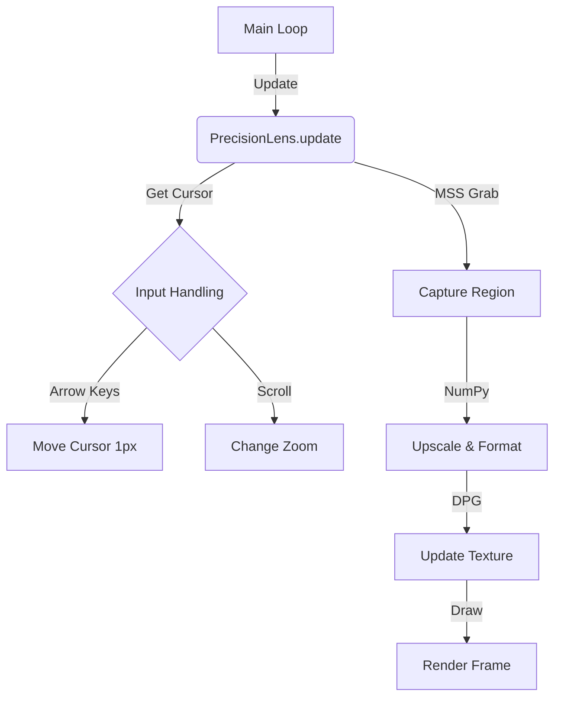

# Precision Lens V3 (Redesign Specification)

**Version**: 3.0.0
**Status**: Draft
**Archetype**: The Artisan (Visual/Physics) + The Sage (Logic/Data)

## 1. Executive Summary

The **Precision Lens** is a standalone, high-performance screen magnifier and color picking tool designed to replace the legacy `PrecisionPicker`. It operates as a "lens" that floats over the desktop, providing a magnified view of the pixels underneath the cursor.

**Core Philosophy**: "What you see is what you pick."
**Objective**: Eliminate all friction in color selection. The tool must be instant, accurate (pixel-perfect), and visually distinct from the rest of the OS.

## 2. Architecture & Design

### 2.1 Class Structure

The system will be encapsulated in a single class `PrecisionLens` residing in `gui/precision_lens.py` (new file), keeping it distinct from the legacy `gui/precision_picker.py` which will be deprecated.

```python
class PrecisionLens:
    """
    [The Artisan]
    A high-precision, circular screen magnifier for pixel-perfect color selection.
    """
    def __init__(self, app: Any, on_pick: Callable[[int], None]): ...
    def start(self): ...
    def stop(self): ...
    def update(self): ...  # Called every frame by main loop
```

### 2.2 Visual Design Specification

The UI is composed of a **DearPyGui Viewport** configured to be:
1.  **Frameless**: No title bar, borders, or OS decorations.
2.  **Always-on-Top**: Floats above all other windows.
3.  **Transparent Background**: Allows for non-rectangular shapes (circular mask).
4.  **Size**: Fixed 220x220px (Lens) + 80px (Data Pill) = ~300x300px canvas.

#### Components:
1.  **The Lens (Viewport)**:
    *   **Shape**: Circular, defined by a high-sample circle drawing with a transparent background.
    *   **Content**: Nearest-neighbor upscaled screenshot of the area under cursor.
    *   **Bezel**: Thick, dark semi-transparent ring to separate lens from background content.
    *   **Grid**: Dynamic pixel grid that fades in at higher zoom levels.
    *   **Crosshair**: 1px Cyan/Magenta inverted line ensuring visibility on any color.
2.  **Data Pill (Telemetry)**:
    *   **Location**: Floating below the lens.
    *   **Content**: Hex Code (e.g., `#C9008D`), RGB Values, and XY Coordinates.
    *   **Style**: Rounded rectangle, blurred background, high-contrast text.

### 2.3 Logic & Backend

#### Capture Pipeline (The Sage)
1.  **Input**: Global mouse coordinates `(x, y)` via `ctypes.windll.user32.GetCursorPos`.
2.  **Capture**: `mss` grabs a small region (e.g., 20x20px) around the cursor.
3.  **Processing**:
    *   **NumPy Upscaling**: Use `np.repeat` for fast nearest-neighbor scaling (no blurry bilinear filtering).
    *   **Color Extraction**: Center pixel extracted directly from NumPy array.
4.  **Rendering**:
    *   Convert buffer to `float32` (0.0-1.0) for DPG Texture.
    *   Update `dpg.add_dynamic_texture` buffer.

#### Input Handling
*   **Mouse Movement**: The lens tracks the mouse cursor.
*   **Arrow Keys**: When active, arrow keys hijack the cursor position via `ctypes.windll.user32.SetCursorPos` for 1px micro-adjustments.
*   **Scroll Wheel**: Adjusts zoom level (Capture Size vs Texture Size ratio).
*   **Left Click**: Confirm selection (Triggers callback, closes lens).
*   **Right Click / ESC**: Cancel (Closes lens).

## 3. Technical Implementation Details

### 3.1 Data Flow


### 3.2 Zoom Levels
| Level | Capture Size (px) | Magnification | Grid Visibility |
|-------|-------------------|---------------|-----------------|
| 1     | 40x40             | 4x            | Low             |
| 2     | 20x20             | 8x            | Medium          |
| 3     | 10x10             | 16x           | High            |

### 3.3 ULTRATHINK Considerations

#### 5D Reasoning Checklist:
1.  **Performance**:
    *   **Risk**: MSS Capture is slow (10-30ms).
    *   **Solution**: Since the picker is a modal "pause" state for the user, 30-60 FPS is acceptable. We do *not* need 240Hz here. We will throttle the update loop to ~60Hz to save CPU cycles if needed, though DPG is efficient.
    *   **Optimization**: Reuse the same `mss` instance. Reuse NumPy arrays.
2.  **Edge Cases (Screen Boundaries)**:
    *   **Problem**: Capturing at `x=0` crashes MSS (negative crop).
    *   **Solution**: Clamping logic in `utils/screen_info.py` or inline. If capture area goes off-screen, pad the result with black/transparent pixels or clamp the capture rect.
3.  **Multi-Monitor**:
    *   MSS handles multi-monitor automatically if coordinates are correct. We must ensure `GetCursorPos` aligns with MSS's coordinate system (usually does on Windows).
4.  **Threading**:
    *   The lens runs on the Main GUI thread. `mss.grab` is blocking.
    *   **Mitigation**: The capture area is tiny (max 40x40). MSS is extremely fast for small regions. Blocking on main thread is acceptable for this specific tool.

### 3.4 Key Functions

```python
def _setup_ui(self):
    """
    Constructs the DPG Window and Drawlist.
    Uses 'no_background=True' and draws a circle with color to simulate a round window.
    """

def update(self):
    """
    1. Get Mouse (ctypes).
    2. Handle Keys (Arrow/Esc/Click).
    3. Calculate Capture Rect (Clamp to screen).
    4. MSS Grab -> NumPy -> Texture.
    5. Update DPG items (Texture, Text, Viewport Pos).
    """
```

## 4. Migration Plan

1.  **Create** `gui/precision_lens.py` implementing the new specification.
2.  **Update** `gui/main_window.py` to import `PrecisionLens` instead of `PrecisionPicker`.
3.  **Replace** the instantiation in `MainWindow.__init__`.
4.  **Verify** functionality:
    *   Start/Stop.
    *   Zoom.
    *   Pixel picking accuracy.
    *   Boundary behavior.
5.  **Delete** `gui/precision_picker.py`.

## 5. Security & Safety
*   **Exception Handling**: Wrap MSS grab in try/catch to prevent crashing app if screen locks or resolution changes.
*   **Resource Cleanup**: Ensure `mss` instance is closed on `stop()`.
*   **Viewport Restoration**: Crucial. Must restore the main window's viewport settings (decorated, resizable) if they were modified, or if the Lens uses a *separate* viewport (DPG limitation: usually one viewport per app unless using experimental features. We will stick to the "Morphing Viewport" technique used currently: Retain Main Window logic, but when Lens is active, we might actually be hiding the main window and showing a popup, OR we just move the main viewport?
    *   *Correction*: The current `PrecisionPicker` implementation **moves and resizes the entire application viewport** to act as the lens. This is a clever hack for single-viewport DPG apps.
    *   **Strategy**: We will continue this "Morphing" strategy. It ensures we don't need multi-window management which DPG struggles with cross-platform.
    *   **Risk**: If the app crashes while morphed, the user is left with a tiny 200px window.
    *   **Safeguard**: `atexit` handler or `finally` block in `main.py` to restore default viewport size (1920x1080 or saved config) on exit.

```python
# Viewport Morphing Logic
original_pos = dpg.get_viewport_pos()
original_size = [dpg.get_viewport_width(), dpg.get_viewport_height()]

# Morph
dpg.configure_viewport(decorated=False, width=300, height=300, always_on_top=True)
```

## 6. Success Metrics
*   **Visuals**: Looks like a native tool (e.g., PowerToys Color Picker).
*   **Accuracy**: Returns the exact hex code of the pixel at `(x, y)`.
*   **UX**: Zero confusion. Arrow keys just work. Esc just works.