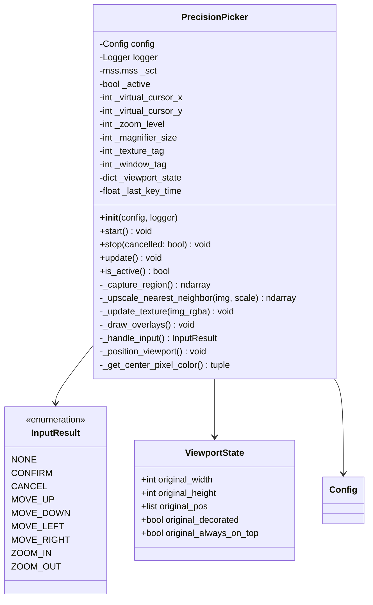
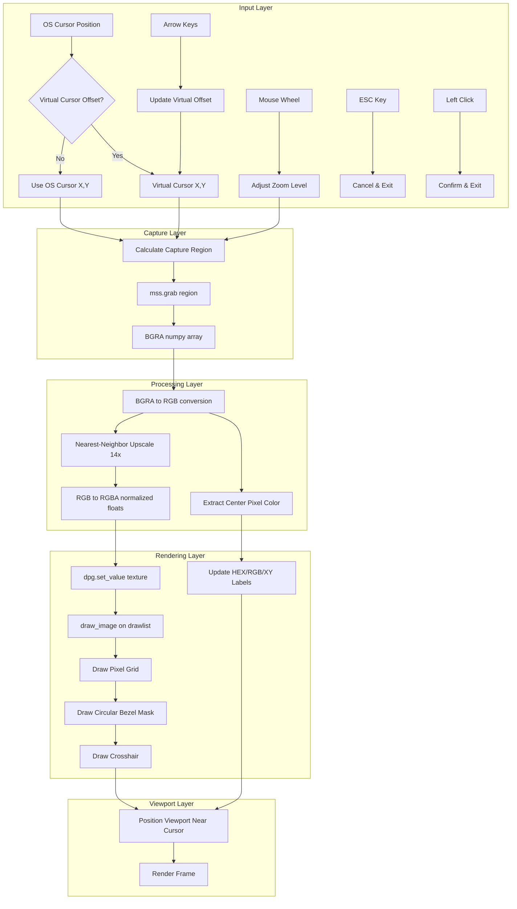
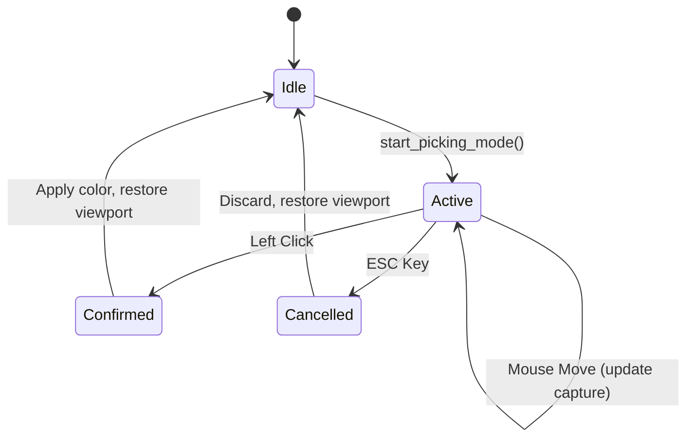
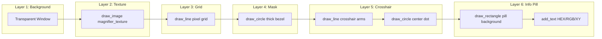

# Precision Picker System - Technical Design Document

**Version**: 1.0.0  
**Author**: Kilo Code Architect  
**Date**: 2026-01-02  
**Status**: ULTRATHINK Design Complete

---

## Executive Summary

This document specifies the complete redesign of the color picker system, replacing the current implementation in [`main.py`](../main.py:544) with a new **PrecisionPicker** module. The system provides a global magnifier viewport that tracks pixels anywhere on the desktop, with pixel-perfect arrow key navigation, manual nearest-neighbor upscaling, and a circular "Precision Lens" design.

---

## 1. Current Implementation Analysis

### 1.1 Existing Architecture (Gravity Assessment)

The current color picker is embedded directly in [`ColorTrackerAlgo`](../main.py:38) class with the following components:

| Component | Location | Description |
|-----------|----------|-------------|
| [`start_picking_mode()`](../main.py:544) | main.py:544-578 | Entry point, saves viewport state, initializes magnifier |
| [`_setup_magnifier_ui()`](../main.py:580) | main.py:580-658 | Creates DPG window, texture, drawlist overlays |
| [`_update_picking_logic()`](../main.py:660) | main.py:660-813 | Main loop logic: capture, upscale, render, input handling |
| [`_exit_picking_mode()`](../main.py:815) | main.py:815-861 | Cleanup and state restoration |
| [`_refresh_magnifier_grid()`](../main.py:209) | main.py:209-277 | Redraws grid, bezel, crosshair overlays |
| [`_on_mouse_wheel()`](../main.py:186) | main.py:186-207 | Zoom level adjustment via scroll |

### 1.2 Current Limitations

1. **Tight Coupling**: Picker logic is embedded in the main application class (~300 lines)
2. **No Virtual Cursor**: Arrow keys move the OS cursor, not a virtual offset
3. **Limited Zoom Levels**: Fixed array `[8, 10, 16, 20]` with no fine-grained control
4. **Circular Mask via Bezel**: Uses thick circle overlay to hide square corners (not true masking)
5. **Input Handling**: Uses `ctypes.windll.user32.GetAsyncKeyState()` directly (works but not DPG-native)

### 1.3 Framework Constraints (Gravity)

| Constraint | Impact | Mitigation |
|------------|--------|------------|
| DearPyGui lacks native circular texture clipping | Cannot mask texture to circle | Use thick circular bezel overlay (current approach is valid) |
| DPG keyboard handlers require focus | Arrow keys may not work when viewport is unfocused | Use `ctypes.GetAsyncKeyState()` for global key polling |
| `mss` must be initialized in main thread | Cannot use in background threads | Already handled correctly in current code |
| Viewport position updates are synchronous | May cause slight lag when following cursor | Acceptable for picker use case |

---

## 2. PrecisionPicker Architecture

### 2.1 Module Structure

```
gui/
├── __init__.py
├── main_window.py          # Existing GUI setup
└── precision_picker.py     # NEW: Self-contained picker module
```

### 2.2 Class Diagram



### 2.3 Data Flow Diagram



---

## 3. Screen Capture Strategy

### 3.1 Capture Region Calculation

The capture region is centered on the **virtual cursor position**, which is the OS cursor position plus any arrow key offset.

```python
# Coordinate System
virtual_x = os_cursor_x + arrow_offset_x
virtual_y = os_cursor_y + arrow_offset_y

# Capture region (centered on virtual cursor)
half_zoom = zoom_level // 2
capture_region = {
    "left": virtual_x - half_zoom,
    "top": virtual_y - half_zoom,
    "width": zoom_level,
    "height": zoom_level
}
```

### 3.2 Zoom Levels

| Zoom Level | Capture Size | Scale Factor | Pixel Block Size | Description |
|------------|--------------|--------------|------------------|-------------|
| 8 | 8x8 | 20x | 20px | Maximum zoom (8 pixels visible) |
| 10 | 10x10 | 16x | 16px | High zoom |
| 12 | 12x12 | 13.3x | ~13px | Medium-high zoom |
| 14 | 14x14 | 11.4x | ~11px | **Default** (14 pixels visible) |
| 16 | 16x16 | 10x | 10px | Medium zoom |
| 20 | 20x20 | 8x | 8px | Low zoom |

**Magnifier Size**: Fixed at 160x160 pixels for optimal clarity.

### 3.3 Edge Case: Screen Boundaries

When the virtual cursor approaches screen edges, the capture region may extend beyond screen bounds.

**Strategy: Padding with Black Pixels**

```python
def _capture_region(self) -> np.ndarray:
    # Calculate capture bounds
    left = self._virtual_cursor_x - self._half_zoom
    top = self._virtual_cursor_y - self._half_zoom
    right = left + self._zoom_level
    bottom = top + self._zoom_level
    
    # Clamp to screen bounds
    screen_w, screen_h = self._screen_size
    clamped_left = max(0, left)
    clamped_top = max(0, top)
    clamped_right = min(screen_w, right)
    clamped_bottom = min(screen_h, bottom)
    
    # Capture clamped region
    capture = {
        "left": clamped_left,
        "top": clamped_top,
        "width": clamped_right - clamped_left,
        "height": clamped_bottom - clamped_top
    }
    sct_img = self._sct.grab(capture)
    img = np.frombuffer(sct_img.bgra, dtype=np.uint8).reshape(
        (sct_img.height, sct_img.width, 4)
    )
    
    # Create padded output if needed
    if left < 0 or top < 0 or right > screen_w or bottom > screen_h:
        padded = np.zeros((self._zoom_level, self._zoom_level, 4), dtype=np.uint8)
        paste_x = max(0, -left)
        paste_y = max(0, -top)
        padded[paste_y:paste_y+img.shape[0], paste_x:paste_x+img.shape[1]] = img
        return padded
    
    return img
```

---

## 4. Coordinate Translation System

### 4.1 Coordinate Spaces

| Space | Origin | Units | Description |
|-------|--------|-------|-------------|
| **Screen Space** | Top-left of primary monitor | Pixels | OS cursor coordinates |
| **Virtual Space** | Screen Space + Arrow Offset | Pixels | Logical cursor for picking |
| **Capture Space** | Top-left of capture region | Pixels | Relative to captured image |
| **Texture Space** | Top-left of upscaled texture | Pixels | 160x160 normalized |
| **UI Space** | Top-left of DPG window | Pixels | Drawlist coordinates |

### 4.2 Translation Formulas

```python
# Screen -> Virtual (add arrow offset)
virtual_x = screen_x + arrow_offset_x
virtual_y = screen_y + arrow_offset_y

# Virtual -> Capture (subtract capture origin)
capture_x = virtual_x - capture_left
capture_y = virtual_y - capture_top

# Capture -> Texture (multiply by scale)
texture_x = capture_x * scale_factor
texture_y = capture_y * scale_factor

# Texture -> UI (add drawlist offset)
ui_x = texture_x + drawlist_offset_x  # e.g., 20
ui_y = texture_y + drawlist_offset_y  # e.g., 10

# Center pixel in capture space
center_capture_x = zoom_level // 2
center_capture_y = zoom_level // 2

# Center pixel in UI space (for crosshair)
center_ui_x = (center_capture_x * scale_factor) + drawlist_offset_x + (scale_factor / 2)
center_ui_y = (center_capture_y * scale_factor) + drawlist_offset_y + (scale_factor / 2)
```

---

## 5. Input Handling Design

### 5.1 Input Sources

| Input | Method | Reason |
|-------|--------|--------|
| Arrow Keys | `ctypes.windll.user32.GetAsyncKeyState()` | Global capture even when unfocused |
| ESC Key | `ctypes.windll.user32.GetAsyncKeyState()` | Global capture |
| Left Click | `ctypes.windll.user32.GetAsyncKeyState()` | Global capture |
| Mouse Wheel | `dpg.add_mouse_wheel_handler()` | DPG native, works when viewport focused |

### 5.2 Arrow Key Navigation

**Virtual Cursor Offset**: Instead of moving the OS cursor, we maintain an offset that is added to the OS cursor position.

```python
class PrecisionPicker:
    def __init__(self, ...):
        self._arrow_offset_x = 0
        self._arrow_offset_y = 0
        self._key_repeat_delay = 0.05  # 50ms between key repeats
        self._last_key_time = 0.0
    
    def _handle_arrow_keys(self) -> bool:
        current_time = time.perf_counter()
        if current_time - self._last_key_time < self._key_repeat_delay:
            return False
        
        moved = False
        # VK_LEFT=0x25, VK_UP=0x26, VK_RIGHT=0x27, VK_DOWN=0x28
        if ctypes.windll.user32.GetAsyncKeyState(0x25) & 0x8000:
            self._arrow_offset_x -= 1
            moved = True
        if ctypes.windll.user32.GetAsyncKeyState(0x27) & 0x8000:
            self._arrow_offset_x += 1
            moved = True
        if ctypes.windll.user32.GetAsyncKeyState(0x26) & 0x8000:
            self._arrow_offset_y -= 1
            moved = True
        if ctypes.windll.user32.GetAsyncKeyState(0x28) & 0x8000:
            self._arrow_offset_y += 1
            moved = True
        
        if moved:
            self._last_key_time = current_time
        return moved
```

### 5.3 Input State Machine



---

## 6. Visual Rendering Strategy

### 6.1 Rendering Pipeline



### 6.2 Circular Bezel Mask

Since DearPyGui doesn't support circular texture clipping, we use a thick circular ring to mask the square texture corners.

```python
def _draw_circular_bezel(self):
    center = self._magnifier_size / 2
    radius = self._magnifier_size / 2
    bezel_thickness = 40.0  # Thick enough to cover corners
    
    # Outer masking ring (matches window background)
    dpg.draw_circle(
        center=[center + offset_x, center + offset_y],
        radius=radius + bezel_thickness / 2,
        color=(30, 30, 35, 255),  # Dark background color
        thickness=bezel_thickness,
        parent="mag_drawlist"
    )
    
    # Inner lens border (crisp white edge)
    dpg.draw_circle(
        center=[center + offset_x, center + offset_y],
        radius=radius,
        color=(255, 255, 255, 200),
        thickness=1.5,
        parent="mag_drawlist"
    )
```

### 6.3 Pixel Grid Overlay

```python
def _draw_pixel_grid(self):
    px_size = self._magnifier_size // self._zoom_level
    grid_alpha = 20  # Subtle grid
    
    for i in range(self._zoom_level + 1):
        line_pos = i * px_size
        # Vertical lines
        dpg.draw_line(
            [line_pos + ox, oy],
            [line_pos + ox, self._magnifier_size + oy],
            color=(255, 255, 255, grid_alpha),
            parent="mag_drawlist"
        )
        # Horizontal lines
        dpg.draw_line(
            [ox, line_pos + oy],
            [self._magnifier_size + ox, line_pos + oy],
            color=(255, 255, 255, grid_alpha),
            parent="mag_drawlist"
        )
```

### 6.4 Surgical Crosshair

```python
def _draw_crosshair(self):
    # Calculate center pixel position in UI space
    center_idx = self._zoom_level // 2
    px_size = self._magnifier_size // self._zoom_level
    cs = px_size * center_idx
    ce = cs + px_size
    mid = (cs + ce) / 2
    mx, my = mid + ox, mid + oy
    
    cross_color = (0, 255, 255, 255)  # Cyan
    gap = 4  # Gap around center for visibility
    ext = 12  # Arm length
    
    # Horizontal arms
    dpg.draw_line([mx - gap - ext, my], [mx - gap, my], 
                  color=cross_color, thickness=1, parent="mag_drawlist")
    dpg.draw_line([mx + gap, my], [mx + gap + ext, my], 
                  color=cross_color, thickness=1, parent="mag_drawlist")
    
    # Vertical arms
    dpg.draw_line([mx, my - gap - ext], [mx, my - gap], 
                  color=cross_color, thickness=1, parent="mag_drawlist")
    dpg.draw_line([mx, my + gap], [mx, my + gap + ext], 
                  color=cross_color, thickness=1, parent="mag_drawlist")
    
    # Center dot
    dpg.draw_circle([mx, my], 1.0, color=cross_color, fill=cross_color, 
                    parent="mag_drawlist")
```

### 6.5 Dynamic Data Pill

```python
def _draw_info_pill(self, r, g, b, x, y):
    # Calculate luminance for contrast
    luminance = 0.299 * r + 0.587 * g + 0.114 * b
    
    # Adaptive background
    if luminance < 80:
        bg_fill = (240, 240, 245, 230)
        bg_border = (255, 255, 255, 240)
    else:
        bg_fill = (30, 30, 35, 230)
        bg_border = (40, 40, 45, 240)
    
    dpg.configure_item("mag_pill_bg", fill=bg_fill, color=bg_border)
    
    # Update text with color matching hovered pixel
    hex_str = f"#{r:02X}{g:02X}{b:02X}"
    dpg.set_value(self._hex_text, f"HEX: {hex_str}")
    dpg.configure_item(self._hex_text, color=[r, g, b])
    
    dpg.set_value(self._rgb_text, f"RGB: ({r}, {g}, {b})")
    dpg.configure_item(self._rgb_text, color=[r, g, b])
    
    dpg.set_value(self._coord_text, f"XY: ({x}, {y})")
```

---

## 7. Performance Considerations

### 7.1 Optimization Strategies

| Strategy | Implementation | Impact |
|----------|----------------|--------|
| **Small Capture Region** | Capture only `zoom_level x zoom_level` pixels (8-20px) | Minimal mss overhead |
| **NumPy Vectorized Upscale** | `np.repeat()` for nearest-neighbor | ~0.1ms for 14x14 -> 160x160 |
| **Pre-allocated Texture** | Reuse dynamic texture, only update values | Avoid GPU texture recreation |
| **Lazy MSS Init** | Initialize `mss.mss()` only when picker starts | No overhead when not picking |
| **Drawlist Caching** | Only redraw grid/bezel on zoom change | Reduce draw calls per frame |
| **Rate-Limited Key Repeat** | 50ms delay between arrow key movements | Prevent runaway cursor |

### 7.2 Expected Performance

| Operation | Target Time | Notes |
|-----------|-------------|-------|
| Screen Capture | < 0.5ms | 14x14 region is trivial |
| Color Conversion | < 0.1ms | BGRA -> RGB slice |
| Upscaling | < 0.2ms | np.repeat 14x14 -> 160x160 |
| Texture Update | < 0.3ms | dpg.set_value with flat array |
| Overlay Drawing | < 0.2ms | ~50 draw calls |
| **Total Frame** | < 2ms | 500+ FPS capable |

---

## 8. API Specification

### 8.1 PrecisionPicker Class

```python
class PrecisionPicker:
    """
    [Archetype B: The Artisan - Visual/Physics]
    High-precision color picker with global magnification and pixel-perfect navigation.
    """
    
    def __init__(self, config: Config, logger: Logger) -> None:
        """
        Initialize the precision picker.
        
        Args:
            config: Application configuration object
            logger: Logger instance for debug output
        """
        pass
    
    def start(self) -> None:
        """
        Enter picking mode.
        - Saves current viewport state
        - Initializes MSS capture
        - Creates magnifier UI
        - Transforms viewport into floating lens
        """
        pass
    
    def stop(self, cancelled: bool = False) -> None:
        """
        Exit picking mode.
        
        Args:
            cancelled: If True, discard picked color. If False, apply to config.
        """
        pass
    
    def update(self) -> None:
        """
        Main update loop. Call once per frame while active.
        - Captures screen region
        - Processes and upscales image
        - Updates texture and overlays
        - Handles input
        - Positions viewport
        """
        pass
    
    def is_active(self) -> bool:
        """Returns True if picker is currently active."""
        pass
    
    @property
    def picked_color(self) -> int:
        """Returns the last picked color as 0xRRGGBB integer."""
        pass
```

### 8.2 Integration with Main Application

```python
# In ColorTrackerAlgo.__init__()
from gui.precision_picker import PrecisionPicker
self.precision_picker = PrecisionPicker(self.config, self.logger)

# In ColorTrackerAlgo.start_picking_mode()
def start_picking_mode(self, sender=None, app_data=None):
    if self.precision_picker.is_active():
        return
    
    # Pause tracking
    self._was_running_before_pick = self.config.enabled
    if self.config.enabled:
        self.stop_algo_key()
        self.config.enabled = False
    
    self.precision_picker.start()

# In ColorTrackerAlgo.run() main loop
while dpg.is_dearpygui_running():
    if self.precision_picker.is_active():
        self.precision_picker.update()
    # ... rest of loop
```

---

## 9. Testing Strategy

### 9.1 Unit Tests

| Test Case | Description |
|-----------|-------------|
| `test_capture_region_center` | Verify capture region is centered on virtual cursor |
| `test_capture_region_edge_padding` | Verify black padding at screen edges |
| `test_upscale_nearest_neighbor` | Verify 14x14 -> 160x160 produces correct pixel blocks |
| `test_coordinate_translation` | Verify screen -> capture -> texture -> UI math |
| `test_arrow_key_offset` | Verify virtual cursor offset accumulates correctly |
| `test_zoom_level_bounds` | Verify zoom stays within valid range |

### 9.2 Integration Tests

| Test Case | Description |
|-----------|-------------|
| `test_picker_lifecycle` | Start -> Update -> Stop flow |
| `test_color_application` | Picked color correctly applied to config |
| `test_viewport_restoration` | Original viewport state restored after exit |
| `test_tracking_pause_resume` | Tracking paused during pick, resumed after |

---

## 10. Migration Plan

### 10.1 Phase 1: Create Module (Non-Breaking)

1. Create `gui/precision_picker.py` with `PrecisionPicker` class
2. Implement all methods with full functionality
3. Add unit tests in `tests/test_precision_picker.py`

### 10.2 Phase 2: Integration (Minimal Changes)

1. Import `PrecisionPicker` in `main.py`
2. Initialize in `ColorTrackerAlgo.__init__()`
3. Replace `start_picking_mode()` to delegate to `PrecisionPicker.start()`
4. Replace `_update_picking_logic()` call with `PrecisionPicker.update()`
5. Remove old methods: `_setup_magnifier_ui()`, `_refresh_magnifier_grid()`, `_exit_picking_mode()`

### 10.3 Phase 3: Cleanup

1. Remove unused magnifier state variables from `ColorTrackerAlgo`
2. Update `CHANGELOG.md` with new feature
3. Update `docs/user_guide_manual.md` with picker instructions

---

## 11. Appendix: Key Constants

```python
# gui/precision_picker.py

# Magnifier dimensions
MAGNIFIER_SIZE = 160  # Fixed output size in pixels
DEFAULT_ZOOM_LEVEL = 14  # Default capture size (14x14 pixels)
ZOOM_LEVELS = [8, 10, 12, 14, 16, 20]  # Available zoom levels

# UI offsets (for centering texture in window)
TEXTURE_OFFSET_X = 20
TEXTURE_OFFSET_Y = 10

# Window dimensions
WINDOW_WIDTH = MAGNIFIER_SIZE + 40  # 200
WINDOW_HEIGHT = MAGNIFIER_SIZE + 110  # 270

# Input timing
KEY_REPEAT_DELAY = 0.05  # 50ms between arrow key repeats

# Visual styling
GRID_ALPHA = 20
BEZEL_THICKNESS = 40.0
CROSSHAIR_COLOR = (0, 255, 255, 255)  # Cyan
CROSSHAIR_GAP = 4
CROSSHAIR_LENGTH = 12

# Virtual key codes (Windows)
VK_LEFT = 0x25
VK_UP = 0x26
VK_RIGHT = 0x27
VK_DOWN = 0x28
VK_ESCAPE = 0x1B
VK_LBUTTON = 0x01
```

---

## 12. Conclusion

The PrecisionPicker design provides a clean, modular replacement for the current embedded color picker implementation. Key improvements include:

1. **Separation of Concerns**: Self-contained module with clear API
2. **Virtual Cursor**: Arrow keys adjust offset without moving OS cursor
3. **Flexible Zoom**: 6 zoom levels from 8x to 20x magnification
4. **Robust Edge Handling**: Black padding at screen boundaries
5. **Performance Optimized**: < 2ms per frame target
6. **Maintainable**: Clear coordinate translation system documented

The design respects existing framework constraints (DearPyGui, mss, ctypes) while providing a significantly improved user experience for pixel-perfect color selection.

---

**Next Steps**: Switch to Code mode to implement `gui/precision_picker.py` following this specification.