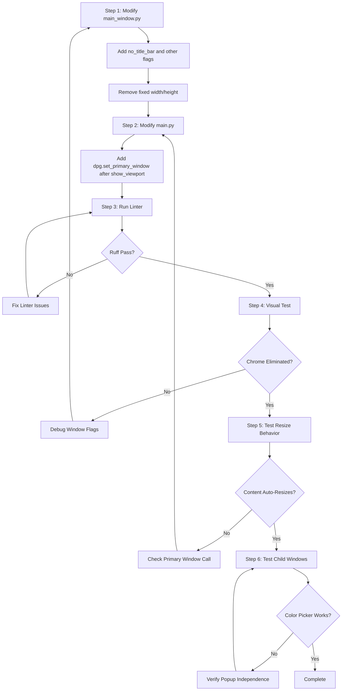

# Primary Window Migration Plan

## Status: COMPLETED (V3.5.1)


## Objective

Eliminate the inner DearPyGui window chrome (blue title bar with "Color Tracking Algo for Single Player Games in Development" and its close button) so that all content renders directly in the viewport, keeping only the Windows 11 native border/title bar.

---

## 1. Current State Analysis

### 1.1 Window Hierarchy Problem

The application currently displays a **"window within window"** pattern:

```
┌─────────────────────────────────────────────────────────────┐
│ [Windows 11 Native Title Bar] ColorTracker Algorithm V3  - □ X │  ← Viewport (Win11 chrome)
├─────────────────────────────────────────────────────────────┤
│ ┌─────────────────────────────────────────────────────────┐ │
│ │ [DPG Inner Title Bar] Color Tracking Algo for Single... X│ │  ← Inner DPG Window (unwanted)
│ ├─────────────────────────────────────────────────────────┤ │
│ │                                                         │ │
│ │  STATUS: Idle    FPS: 0.0                              │ │
│ │  [ACTIVATE TRACKING]                                   │ │
│ │  ────────────────────────────────────                  │ │
│ │  [COMBAT] [VISION] [SYSTEM] [STATS] [DEBUG]            │ │
│ │  ...                                                   │ │
│ │                                                         │ │
│ └─────────────────────────────────────────────────────────┘ │
└─────────────────────────────────────────────────────────────┘
```

### 1.2 Current Implementation

#### Main Window Creation ([`gui/main_window.py:233-235`](gui/main_window.py:233))

```python
with dpg.window(
    tag="main_window", 
    label="Color Tracking Algo for Single Player Games in Development", 
    width=480, 
    height=730
):
```

**Issues:**
- Has a `label` parameter (creates visible title bar text)
- No decoration-disabling flags are set
- Fixed `width` and `height` (won't fill viewport)

#### Viewport Creation ([`main.py:148-156`](main.py:148))

```python
dpg.create_viewport(
    title="ColorTracker Algorithm V3",
    width=self._viewport_original_width,
    height=self._viewport_original_height,
    x_pos=self._viewport_original_pos[0],
    y_pos=self._viewport_original_pos[1],
    decorated=self._viewport_original_decorated,
    always_on_top=self._viewport_original_always_on_top,
)
```

**Notes:**
- `decorated=True` keeps the native Windows title bar (correct)
- `title` sets the Windows title bar text (correct)

#### Call Order ([`main.py:146-157`](main.py:146))

```python
setup_gui(self)                # 1. Creates windows
dpg.create_viewport(...)       # 2. Creates viewport
dpg.setup_dearpygui()          # 3. Initializes DPG
```

Then later in [`run()`](main.py:487):
```python
dpg.show_viewport()            # 4. Shows viewport
```

**No call to `dpg.set_primary_window()` exists.**

---

## 2. Target State Description

### 2.1 Desired Window Hierarchy

```
┌─────────────────────────────────────────────────────────────┐
│ [Windows 11 Native Title Bar] ColorTracker Algorithm V3  - □ X │  ← Viewport (Win11 chrome)
├─────────────────────────────────────────────────────────────┤
│                                                             │
│  STATUS: Idle    FPS: 0.0                                  │  ← Content renders directly
│  [ACTIVATE TRACKING]                                       │     in viewport (no inner chrome)
│  ────────────────────────────────────────────              │
│  [COMBAT] [VISION] [SYSTEM] [STATS] [DEBUG]                │
│  ...                                                       │
│                                                             │
└─────────────────────────────────────────────────────────────┘
```

### 2.2 Primary Window Pattern

DearPyGui's `dpg.set_primary_window()` makes a window:
- **Fill the entire viewport** with no decorations
- **No title bar**, no close/minimize buttons, no move handle
- **Automatically resize** with the viewport
- **Act as the root container** for all UI content

---

## 3. Technical Implementation Plan

### 3.1 Changes Required

#### File 1: [`gui/main_window.py`](gui/main_window.py)

**Location:** Line 233-235

**BEFORE:**
```python
with dpg.window(
    tag="main_window", 
    label="Color Tracking Algo for Single Player Games in Development", 
    width=480, 
    height=730
):
```

**AFTER:**
```python
with dpg.window(
    tag="main_window",
    label="",  # Empty label - no title bar text needed
    no_title_bar=True,
    no_move=True,
    no_resize=True,
    no_collapse=True,
    no_close=True,
    no_scrollbar=False,  # Keep scrollbar if content overflows
):
```

**Rationale:**
- `no_title_bar=True` - Removes the inner title bar completely
- `no_move=True` - Prevents dragging (will fill viewport anyway)
- `no_resize=True` - Prevents resize handles (viewport handles resizing)
- `no_collapse=True` - Removes collapse button
- `no_close=True` - Removes close button (use native window X)
- Remove `width` and `height` - Primary window fills viewport automatically

---

#### File 2: [`main.py`](main.py)

**Location:** After `dpg.show_viewport()` at line 487

**BEFORE:**
```python
def run(self):
    """Start the DearPyGui main loop with performance optimizations"""
    self.logger.info("Launching GUI main loop...")
    dpg.show_viewport()

    self.start_time = time.time()
```

**AFTER:**
```python
def run(self):
    """Start the DearPyGui main loop with performance optimizations"""
    self.logger.info("Launching GUI main loop...")
    dpg.show_viewport()

    # Set main_window as primary window (fills viewport, no decorations)
    dpg.set_primary_window("main_window", True)

    self.start_time = time.time()
```

**Rationale:**
- Must be called **after** `show_viewport()` for proper initialization
- The `True` parameter enables primary window mode
- Tag `"main_window"` matches the window tag in `setup_gui()`

---

### 3.2 Windows That Should NOT Be Modified

The following windows are separate popups and should retain their current behavior:

| Window | File | Behavior |
|--------|------|----------|
| `"simple_color_picker_window"` | [`gui/color_picker.py:155-163`](gui/color_picker.py:155) | Floating popup window - should remain movable/closable |
| `"reset_confirmation_modal"` | [`gui/main_window.py:768-785`](gui/main_window.py:768) | Modal dialog - should remain as modal |
| `"fov_overlay"` | [`gui/main_window.py:64-88`](gui/main_window.py:64) | Already has `no_title_bar=True` - correctly configured |

---

## 4. Implementation Sequence



---

## 5. Code Changes Summary

### 5.1 File: `gui/main_window.py`

| Line | Change Type | Description |
|------|-------------|-------------|
| 233 | Modify | Change `dpg.window()` parameters |
| 234 | Remove | Delete `label="Color Tracking..."` or set to `""` |
| 234 | Add | Add `no_title_bar=True` |
| 234 | Add | Add `no_move=True` |
| 234 | Add | Add `no_resize=True` |
| 234 | Add | Add `no_collapse=True` |
| 234 | Add | Add `no_close=True` |
| 235 | Remove | Delete `width=480, height=730` |

### 5.2 File: `main.py`

| Line | Change Type | Description |
|------|-------------|-------------|
| 488 | Add | Insert `dpg.set_primary_window("main_window", True)` after `dpg.show_viewport()` |

---

## 6. Testing Considerations

### 6.1 Visual Tests

1. **Chrome Elimination**: Verify the inner blue DPG title bar is completely removed
2. **Native Title Bar**: Confirm Windows 11 title bar remains functional (minimize, maximize, close)
3. **Content Position**: Verify content starts at top-left of viewport (no gap)

### 6.2 Resize Behavior Tests

1. **Viewport Resize**: Drag window edges - content should auto-resize with viewport
2. **Maximize**: Click maximize button - content should fill entire screen
3. **Restore**: Restore from maximized - content should resize correctly

### 6.3 Child Window Tests

1. **Color Picker Popup**: Click "PICK SCREEN COLOR" - popup should appear as floating window
2. **Reset Modal**: Click "RESET ALL SETTINGS" - modal should appear centered
3. **FOV Overlay**: Enable overlay - should draw on screen correctly

### 6.4 Edge Cases

1. **Minimum Size**: Resize viewport very small - check if content clips properly
2. **Scrollbar**: If content exceeds viewport, scrollbar should appear (if `no_scrollbar=False`)
3. **Tab Navigation**: Verify all tabs (COMBAT, VISION, SYSTEM, STATS, DEBUG) remain accessible

---

## 7. Rollback Plan

If issues occur, revert by:

1. **Restore `gui/main_window.py` lines 233-235** to original:
   ```python
   with dpg.window(
       tag="main_window", 
       label="Color Tracking Algo for Single Player Games in Development", 
       width=480, 
       height=730
   ):
   ```

2. **Remove the `dpg.set_primary_window()` line** from `main.py`

---

## 8. Verification Commands

```bash
# Lint check
python -m ruff check gui/main_window.py main.py

# Type check
python -m pyright gui/main_window.py main.py

# Run application to visual test
python main.py
```

---

## 9. References

- [DearPyGui Primary Windows Documentation](https://dearpygui.readthedocs.io/en/latest/documentation/primary-window.html)
- [DearPyGui Window Flags](https://dearpygui.readthedocs.io/en/latest/documentation/windows.html)

---

**Plan Version:** 1.0  
**Author:** Architect Mode  
**Date:** 2026-01-03