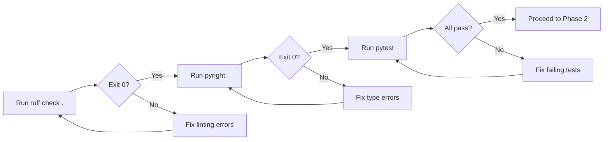
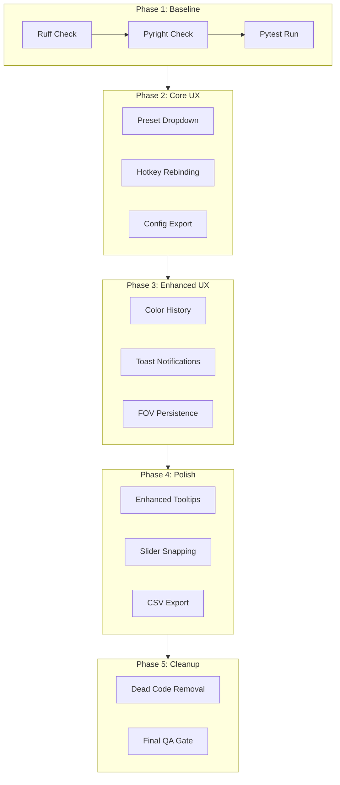

# 🎯 ColorTracker QoL & UX Improvement Plan
## ULTRATHINK-SINGULARITY Analysis V3.5.1

**Status: COMPLETED (Jan 3, 2026)**

**Scope:** Quality of Life, User Experience, Code Hygiene

---

## 📋 Executive Summary

This plan addresses UX flaws, missing features, and code hygiene issues identified through exhaustive analysis of the ColorTracker codebase. The improvements are organized into 5 phases, prioritized by user impact.

---

## 🔍 Identified Issues

### Critical Flaws
| Issue | Location | Description |
|-------|----------|-------------|
| Dead Code | `gui/color_picker.py` | Module is unused - functionality moved to `main.py` |
| Missing UI | `utils/config.py:298` | `PRESETS` dict exists but no UI dropdown |
| Broken UX | `gui/main_window.py:777` | "Rebind Keys" button is disabled |
| No Persistence | `gui/main_window.py:655` | FOV overlay checkbox resets on restart |

### QoL Opportunities
1. **Preset Selector** - Users can't easily switch between default/aggressive/precise/high_fps
2. **Color History** - No way to save frequently used colors
3. **Config Export** - Can't share settings without editing JSON manually
4. **Success Feedback** - No visual confirmation when actions complete
5. **Enhanced Tooltips** - 1 Euro Filter params lack explanation for non-experts

---

## 🏗️ Implementation Phases

### PHASE 1: Baseline Verification
**Purpose:** Ensure current codebase is stable before changes



**Tasks:**
- [ ] Run `python -m ruff check .` - capture baseline
- [ ] Run `python -m pyright .` - capture baseline  
- [ ] Run `python -m pytest` - verify all tests pass

---

### PHASE 2: Core UX Fixes
**Purpose:** Fix the most impactful user-facing issues

#### 2.1 Preset Selector Dropdown
**File:** `gui/main_window.py` → SYSTEM tab  
**Implementation:**
```python
# Add after dpg.add_text("PERFORMANCE", color=(201, 0, 141))
dpg.add_text("PRESETS", color=(201, 0, 141))
app.preset_combo = dpg.add_combo(
    items=list(app.config.PRESETS.keys()),
    default_value="default",
    callback=lambda s, a: [
        app.config.apply_preset(a),
        app.refresh_ui_from_config()
    ][-1],
    width=-1
)
with dpg.tooltip(app.preset_combo):
    dpg.add_text("Quick configuration profiles for different use cases")
```

#### 2.2 Hotkey Rebinding UI
**File:** `gui/main_window.py` → SYSTEM tab  
**Replace disabled button with functional combo boxes:**
```python
# Replace lines 768-781
dpg.add_text("INPUT BINDINGS", color=(201, 0, 141))
with dpg.group(horizontal=True):
    dpg.add_text("START Key: ")
    app.start_key_combo = dpg.add_combo(
        items=["page_up", "page_down", "home", "end", "insert", "delete"],
        default_value=app.config.start_key,
        callback=lambda s, a: app.config.update("start_key", a),
        width=100
    )
with dpg.group(horizontal=True):
    dpg.add_text("STOP Key:  ")
    app.stop_key_combo = dpg.add_combo(
        items=["page_up", "page_down", "home", "end", "insert", "delete"],
        default_value=app.config.stop_key,
        callback=lambda s, a: app.config.update("stop_key", a),
        width=100
    )
```

#### 2.3 Config Export/Import
**File:** `gui/main_window.py` → SYSTEM tab  
**File:** `utils/config.py` → Add export_to_file/import_from_file methods

---

### PHASE 3: Enhanced UX
**Purpose:** Add polish and convenience features

#### 3.1 Color History Panel
**Location:** VISION tab, below color picker  
**Implementation:** Store last 8 picked colors in config, display as clickable swatches

#### 3.2 Success Toast Notifications
**Implementation:** Use DearPyGui popup windows with auto-dismiss timer
```python
def show_toast(message: str, duration: float = 2.0):
    # Create temporary window that auto-closes
    ...
```

#### 3.3 Persist FOV Overlay State
**File:** `utils/config.py` → Add to DEFAULT_CONFIG:
```python
"fov_overlay_enabled": {"type": bool, "default": False}
```

---

### PHASE 4: Advanced Polish
**Purpose:** Expert-level improvements

#### 4.1 Enhanced Tooltips for 1 Euro Filter
**Location:** COMBAT tab → MOTION PHYSICS section
```
Min Cutoff: Controls jitter filtering. 
- Low values (0.1-0.5): Maximum smoothing, slight input lag
- Medium (0.5-5.0): Balanced smoothing and responsiveness  
- High (5.0-25.0): Minimal filtering, raw input feel

Beta: Controls lag reduction during fast movement.
- Low values (0.001-0.01): Smooth but may lag behind fast targets
- Medium (0.01-0.1): Good balance for most scenarios
- High (0.1-0.3): Aggressive lag reduction, may introduce jitter
```

#### 4.2 Slider Step Snapping
- Beta slider: 0.001 increments
- Min Cutoff slider: 0.1 increments
- FOV sliders: 5px increments (already implemented)

#### 4.3 STATS CSV Export
**File:** `gui/main_window.py` → STATS tab
```python
dpg.add_button(
    label="📊 Export to CSV",
    callback=lambda: export_stats_to_csv(),
    width=-1
)
```

---

### PHASE 5: Cleanup & Verification
**Purpose:** Code hygiene and final validation

#### 5.1 Dead Code Removal
- Refactor `gui/color_picker.py` to only contain utility functions
- Or delete entirely if `rgb_to_hex`/`hex_to_rgb` are unused

#### 5.2 Final QA Gate
```bash
python -m ruff check .
python -m pyright .
python -m pytest
```
**Constraint:** All must pass with Exit Code 0

---

## 📊 Impact Assessment

| Feature | User Impact | Implementation Complexity |
|---------|-------------|---------------------------|
| Preset Selector | 🔥 High | Low |
| Hotkey Rebinding | 🔥 High | Medium |
| Config Export | 🔶 Medium | Low |
| Color History | 🔶 Medium | Medium |
| Toast Notifications | 🔷 Low | Low |
| Enhanced Tooltips | 🔶 Medium | Low |
| CSV Export | 🔷 Low | Low |
| Dead Code Cleanup | 🔷 Low | Low |

---

## ✅ Acceptance Criteria

1. All Phase 1 checks pass (ruff, pyright, pytest)
2. Preset dropdown allows switching between 4 presets
3. Hotkey rebinding works and persists to config.json
4. Color history saves last 8 colors
5. FOV overlay state persists across restarts
6. All tooltips provide actionable guidance
7. Final QA gate passes with zero errors

---

## 🔄 Workflow Diagram



---

## 📝 Notes

- All changes must follow AGENTS.md code style guidelines
- Use DearPyGui patterns consistent with existing codebase
- Maintain backward compatibility with existing config.json files
- Test on Windows 10/11 with high-DPI displays